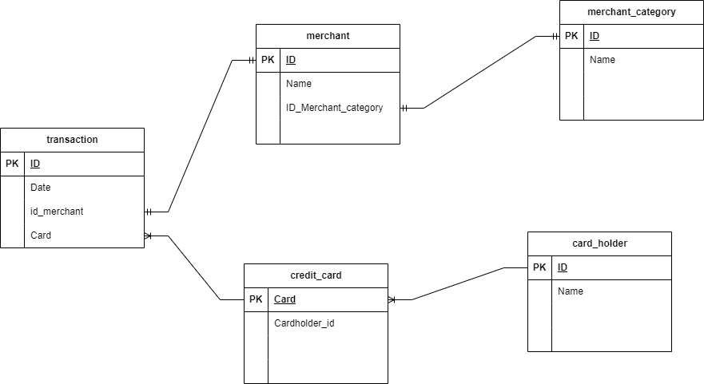

# Unit 7 Homework Assignment: Looking for Suspicious Transactions

This repository has been created to showcase the findings from the module 7 challenge content. 
___

This ERD Diagram displays the relationship between the five csv files provided to track down fraudulent transactions. We can see that each table has its own ID unique ID column that can be utilised in each table to monitor transactions. Some foreign keys are also displayed in the illustration above. 
___

